# Myros_tools
Some convenient tools used in ROS. Contents: 

- **For KITTI**
  - Building globalmap with **dynamic objects** and publishing to rviz and saving.
  - Converting KITTI scans to **range images**.
  - Adding **ring** 0-63 information.
- **Others**
  - Removing dynamic objects using **octomap** offline.
## ⚙️ Requirements

- Based on C++17
- ROS (and Eigen, PCL, OpenMP): the all examples in this readme are tested under Ubuntu 20.04 and ROS Noetic.
- [Kitti data](http://semantic-kitti.org/) setups
  - [百度网盘Kitti data](https://pan.baidu.com/s/1JYfp-gSqZp-7wcS7Tb4DUA) 提取码: jbbc 

  | Car   | Settings |
  | :------------------: | :------------------------------: |
  |  |  |


## ⭐️ Example
- Building globalmap with **dynamic objects** and publishing to rviz and saving.
```C++
roslaunch ros_tools play_kitti.launch
```
<p align="center">
  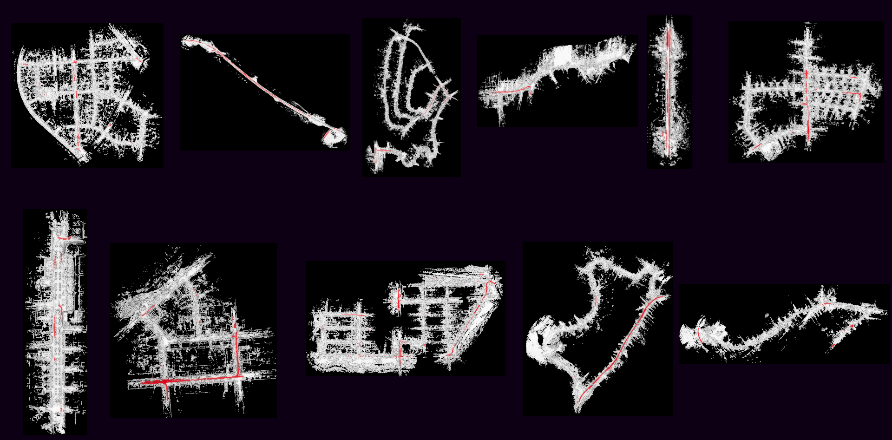
</p>

<table>
  <thead>
    <tr>
      <th colspan="6">Global Map with Dynamic Objects in Red</th>
    </tr>
  </thead>
  <tbody>
    <tr align="center">
      <td> 00 </td><td> 01 </td><td> 02 </td><td> 03 </td><td> 05 </td><td> 04 </td>
    </tr>
  </tbody>
  <tbody>
    <tr>
      <td> <p align="center">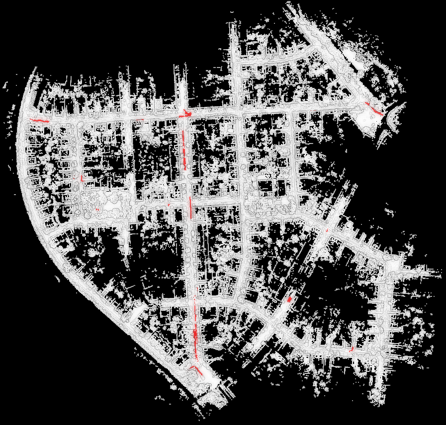</p> </td>
      <td> <p align="center">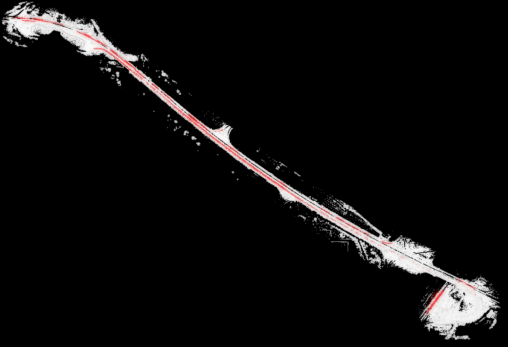</p> </td>
      <td> <p align="center">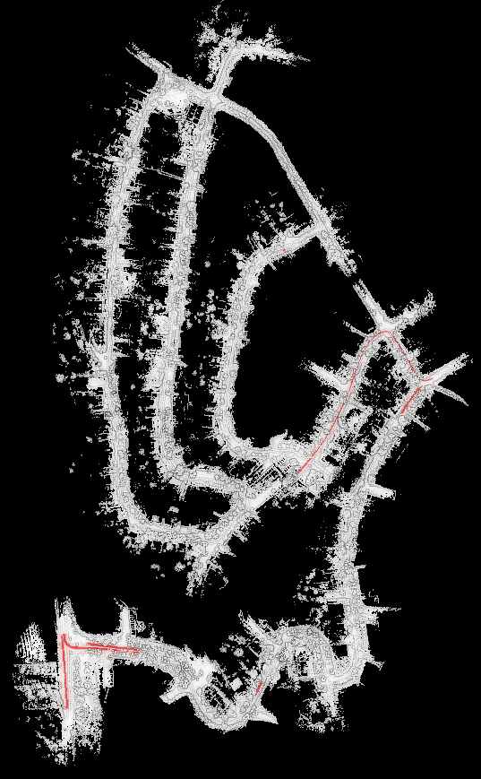</p> </td>
      <td> <p align="center">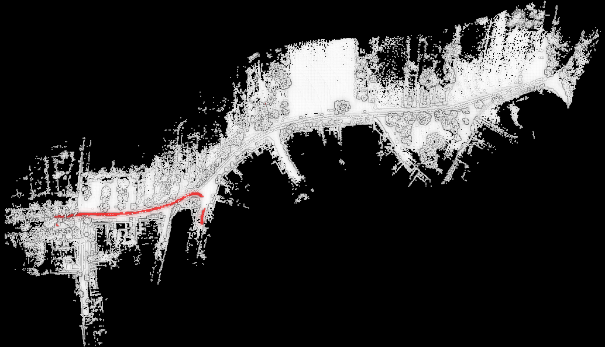</p> </td>
      <td> <p align="center">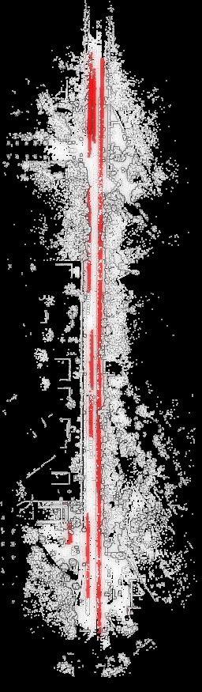</p> </td>
      <td> <p align="center">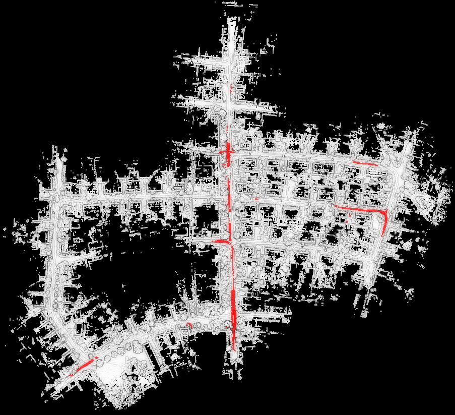</p> </td>
    </tr>
  </tbody>
  <tbody>
    <tr align="center">
      <td> 06 </td><td> 07 </td><td> 08 </td><td> 09 </td><td> 10 </td>
    </tr>
  </tbody>
  <tbody>
    <tr>
      <td> <p align="center">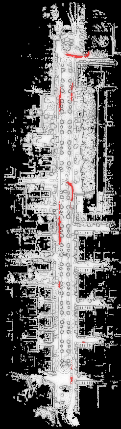</p> </td>
      <td> <p align="center">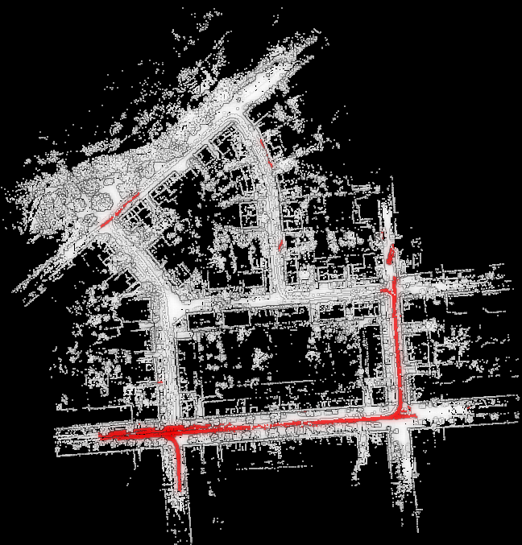</p> </td>
      <td> <p align="center">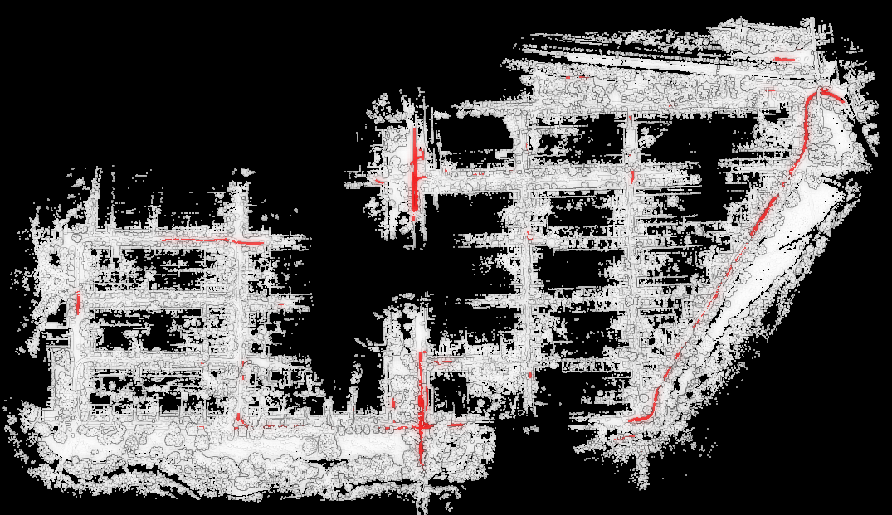</p> </td>
      <td> <p align="center"></p> </td>
      <td> <p align="center">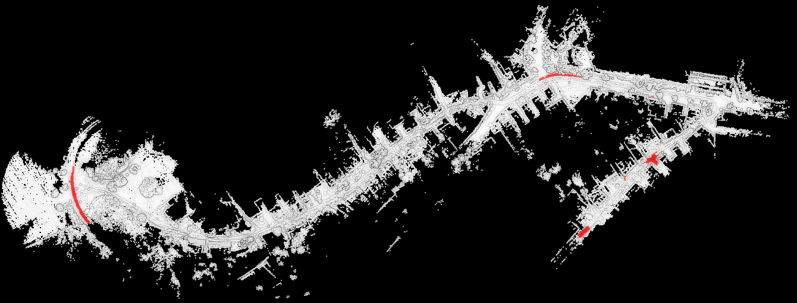</p> </td>
    </tr>
  </tbody>
</table>


- Naive raycasting: Using raycasting methods to remove dynamic objects.(Not upload yet)
  | Original map       | Raycasting dynamic removal     |
  | ------------------ | ------------------------------ |
  |  |  |


- [kitti2range_image](myros_tools/src/kitti2range_image.cpp): Convert the kitti velodyne to range images. **貌似kitti数据集的lidar frame 180度左右存在一个严重的噪点数据，从图像中心可以看出来，有一个蓝色近距离点**
```C++
roslaunch ros_tools range_images.launch
```
<p align="center">
  
</p>

- Adding ring 0-63 information:
<p align="center">
  
</p>


- [kblistening](src/others/kblistening.cpp)：Check whether the keyboard is pressed so that the publication of bin can pause like rosbag.
  - requirement:

    ```C++
    sudo apt-get install libncurses5-dev libncursesw5-dev
    target_link_libraries(your_target_name -lncurses)
    ```

## 💬 Tips

- Subscribe to the topic, and save the pointcloud to pcd file.

```
rosrun pcl_ros pointcloud_to_pcd input:=/point_cloud_topic _prefix:=./pcd_save_path
```

- mp4 to gif.

```
ffmpeg -t 60 -ss 00:00:01 -i Screencast_2019-02-13-24.mp4  out.gif
-t 要截取的视频时长
-ss 开始时间
-i 源视频文件
out.gif 为输出文件名
```

- 转换为range images需要的一些参数：
<p align="center">
  
</p>


## *Reference*

[Removert: https://github.com/irapkaist/removert](https://github.com/irapkaist/removert)

[https://github.com/ulterzlw/kitti2map](https://github.com/ulterzlw/kitti2map)

[https://github.com/wangx1996/Semantic-Kitti-Label-Read/blob/main/semantic_kitti/src/semantic_kitti_read.cpp](https://github.com/wangx1996/Semantic-Kitti-Label-Read/blob/main/semantic_kitti/src/semantic_kitti_read.cpp)