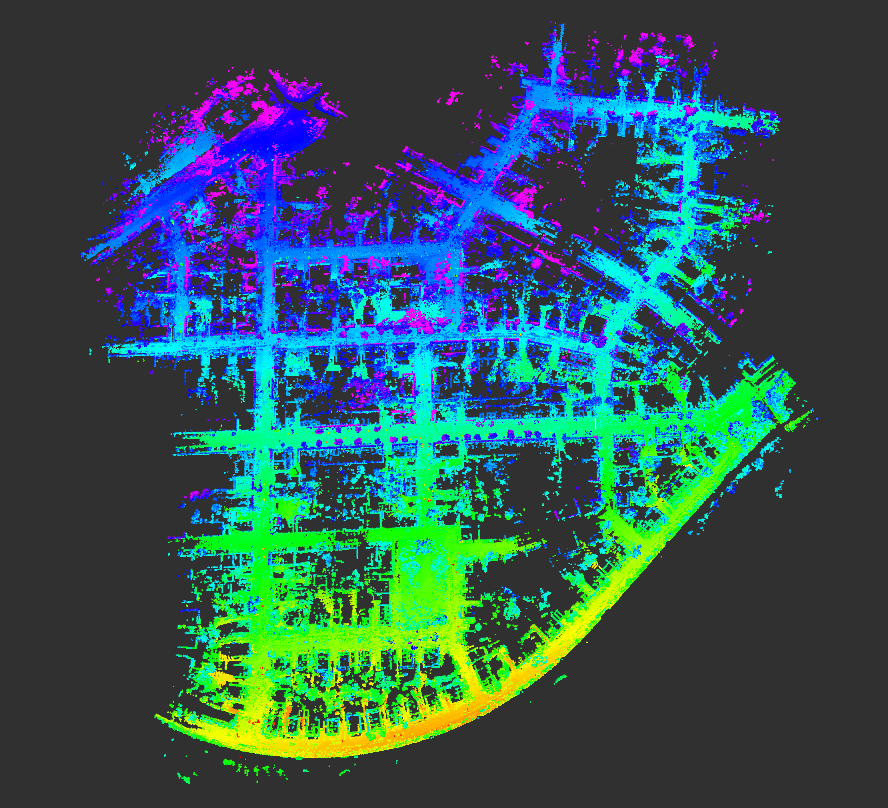
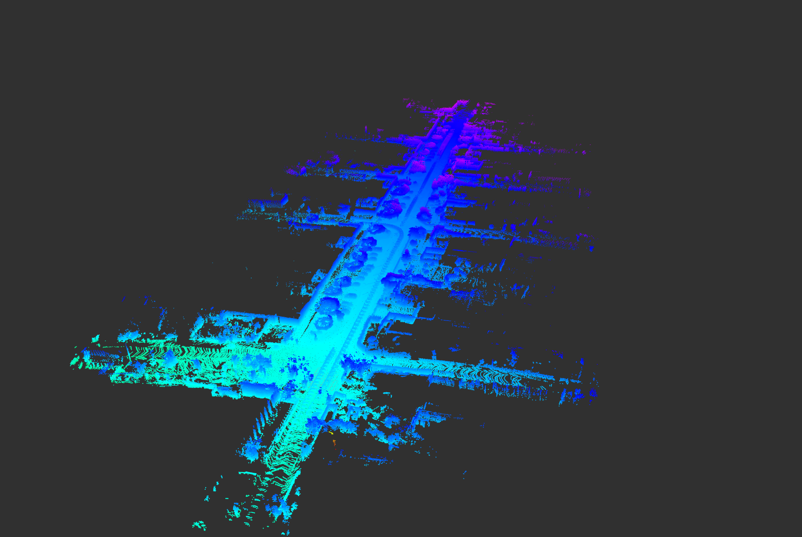
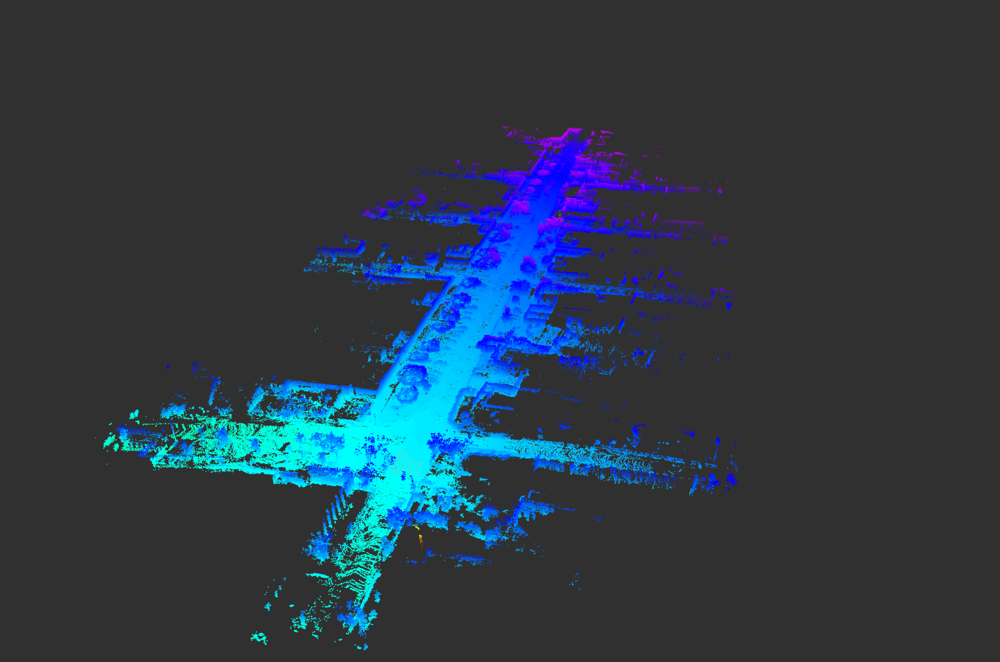
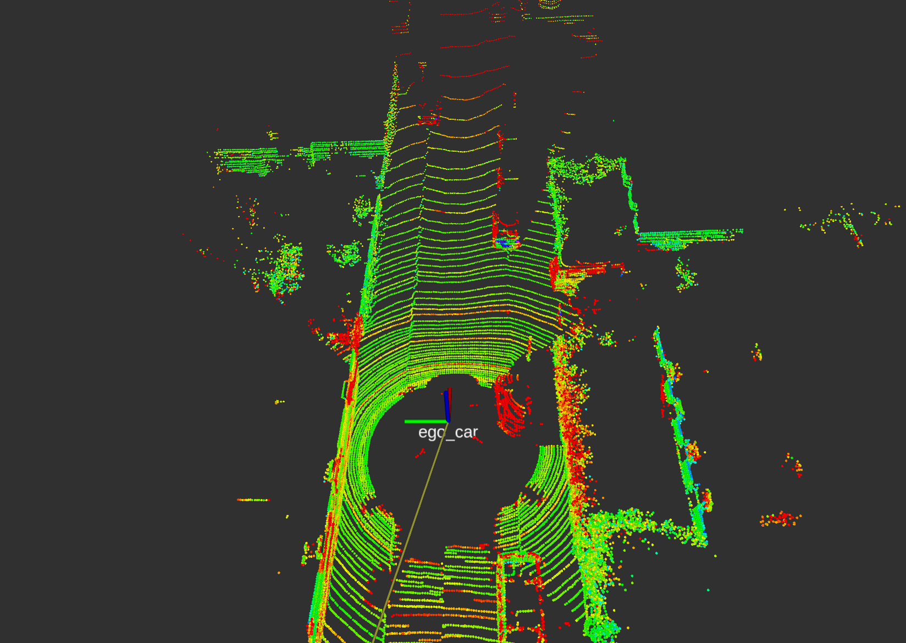
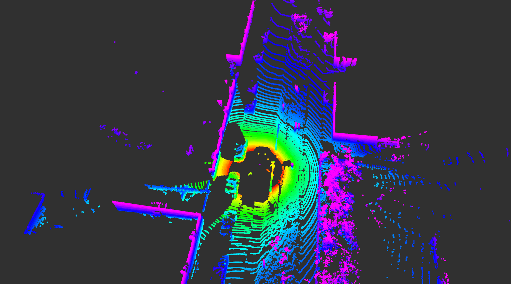
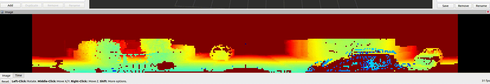
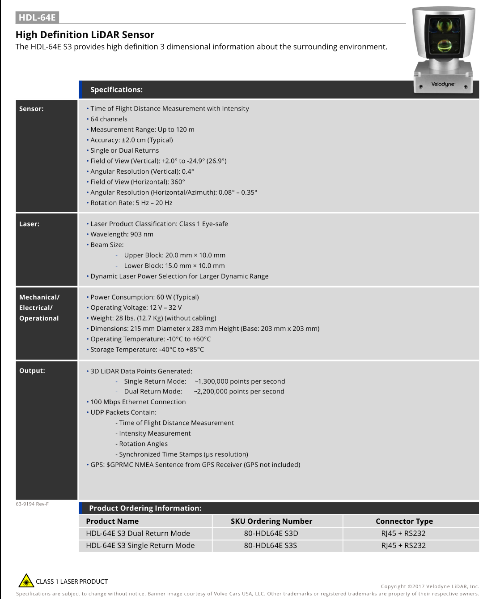

# *Myros_tools*

- Some tools used in ROS.

## ⚙️ Requirements

- Based on C++17
- ROS (and Eigen, PCL, OpenMP): the all examples in this readme are tested under Ubuntu 20.04 and ROS Noetic.
- kitti data setups
  | Original map       | Raycasting dynamic removal     |
  | ------------------ | ------------------------------ |
  |  |  |

## ⭐️ Node Example

- [bin2global_map](myros_tools/src/bin2global_map.cpp): Generates a global map form kitti datas.
  <center></center>

- [pcd_pub](myros_tools/src/pcd_pub.cpp): Publish the global map pcd file to rviz.
  <center></center>

- Poor raycasting: Using raycasting methods to remove dynamic objects.(Not upload yet)
  | Original map       | Raycasting dynamic removal     |
  | ------------------ | ------------------------------ |
  |  |  |
- [play_kitti](myros_tools/src/play_kitti.cpp): Publish the kitti bin data and TF to rviz in real-time in the style of query scan.

```
roslaunch myros_tools play_kitti.launch 
```

<center></center>

- With ring 0-63:
<center></center>

- [kitti2range_image](myros_tools/src/kitti2range_image.cpp): Convert the kitti velodyne to range images. **貌似kitti数据集的lidar frame 180度左右存在一个严重的噪点数据，从图像中心可以看出来，有一个蓝色近距离点**


- [kblistening](src/others/kblistening.cpp)：Check whether the keyboard is pressed so that the publication of bin can pause like rosbag.
  - requirement:

    ```C++
    sudo apt-get install libncurses5-dev libncursesw5-dev
    target_link_libraries(your_target_name -lncurses)
    ```

## 💬 *Notes*

- Subscribe to the topic, and save the pointcloud to pcd file.

```
rosrun pcl_ros pointcloud_to_pcd input:=/point_cloud_topic _prefix:=./pcd_save_path
```

- mp4 to gif.

```
ffmpeg -t 60 -ss 00:00:01 -i Screencast_2019-02-13-24.mp4  out.gif
-t 要截取的视频时长
-ss 开始时间
-i 源视频文件
out.gif 为输出文件名
```

- 转换为range images需要的一些参数：



## *Reference*

[Removert: https://github.com/irapkaist/removert](https://github.com/irapkaist/removert)

[https://github.com/ulterzlw/kitti2map](https://github.com/ulterzlw/kitti2map)
