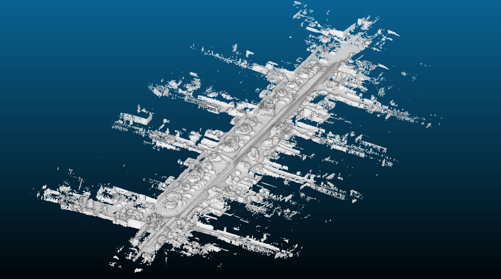

# *Myros_tools*
- Some tools used in ROS.

## Requirements 
- Based on C++17
- ROS (and Eigen, PCL, OpenMP): the all examples in this readme are tested under Ubuntu 20.04 and ROS Noetic.

## :star: Example
- [bin2global_map](myros_tools/src/bin2global_map.cpp): Generates a global map form kitti datas.

- [pcd_pub](myros_tools/src/pcd_pub.cpp): Publish the global map pcd file to rviz.

Poor raycasting: Using raycasting methods to remove dynamic objects. 

- [play_kitti](myros_tools/src/play_kitti.cpp): Publish the kitti bin data to rviz in real-time in the style of query scan.
